# Gaming Behavior & Addiction Risk Analysis

## Overview

This project analyzes gaming behavior patterns to identify key factors associated with addiction risk. Using Python for data analysis and visualization, the study explores how gaming habits, spending behavior, and social factors contribute to varying levels of addiction risk.

## Business Problem

Gaming companies and digital platforms need to understand user behavior to:

* Identify high-risk users
* Promote healthier engagement
* Design better user experiences

This project aims to uncover behavioral patterns that signal increased addiction risk and provide actionable insights.

## Dataset

The dataset includes user-level gaming behavior and lifestyle metrics such as:

* Daily gaming hours
* Monthly game spending
* Social isolation score
* Sleep, exercise, and social interaction hours
* Game genre and demographic data

## Tools Used

* Python (Pandas, NumPy)
* Matplotlib
* SQL

## Key Insights

* Daily gaming hours strongly increase with addiction risk levels
* Social isolation is highly correlated with increased gaming behavior
* Monthly spending rises significantly with higher addiction risk
* Lifestyle trade-offs (sleep, exercise, social interaction) decline with increased gaming
* Demographics such as age and gender have minimal impact on addiction risk

## Business Recommendations

* Implement usage monitoring systems for excessive gaming hours
* Introduce spending alerts for high-risk users
* Design well-being features such as break reminders
* Encourage balanced engagement through platform design
* Develop targeted interventions for high-risk segments

## Visual Analysis

### 1. Numeric Feature Correlation Heatmap (correlation_heatmap.png)

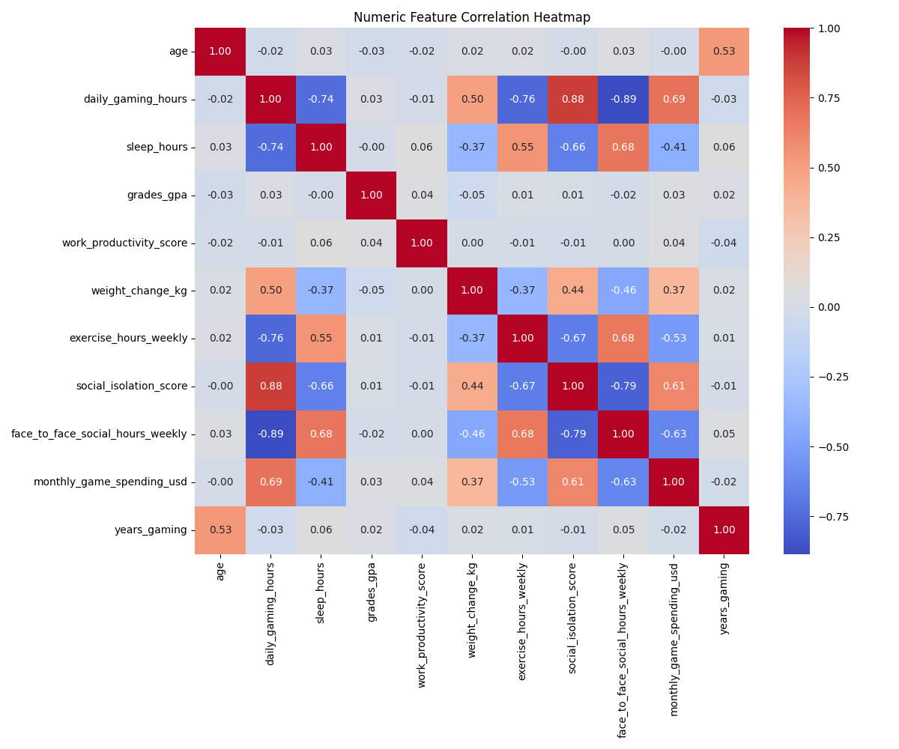
A correlation matrix of numeric features highlighting strong relationships. Gaming hours show strong positive correlation with social isolation (0.88) and strong negative correlation with face-to-face interaction (-0.89), revealing significant behavioral trade-offs.

### 2. Daily Gaming Hours vs Face-to-Face Social Hours (gaming_vs_social_hours.png)

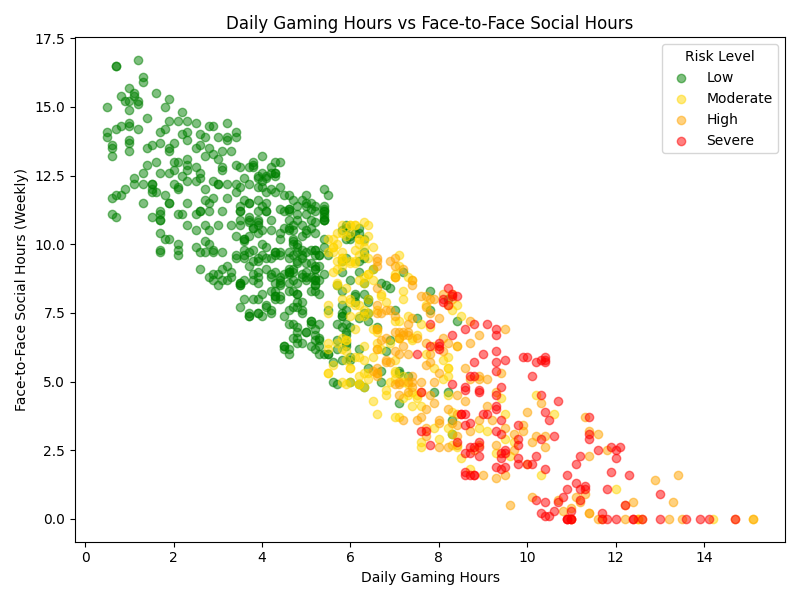
A scatter plot showing a strong negative relationship between gaming and real-world interaction. High-risk users cluster at high gaming hours with minimal social engagement.

### 3. Monthly Spending vs Social Isolation Score (spending_vs_isolation.png)

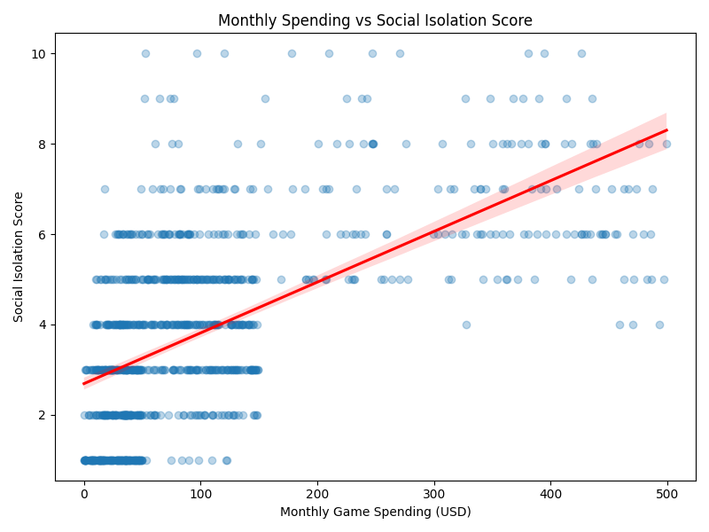
A regression plot showing a moderate positive relationship (0.61). Higher spending is associated with increased social isolation, indicating behavioral clustering.

### 4. Game Genre vs Risk Level (genre_vs_risk.png)

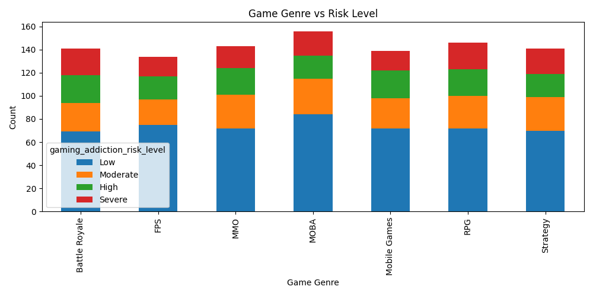
A stacked bar chart comparing genres across risk levels. Risk distribution remains fairly consistent across genres, suggesting genre is not a strong predictor.

### 5. Social Isolation Score by Risk Level (social_isolation_by_risk.png)

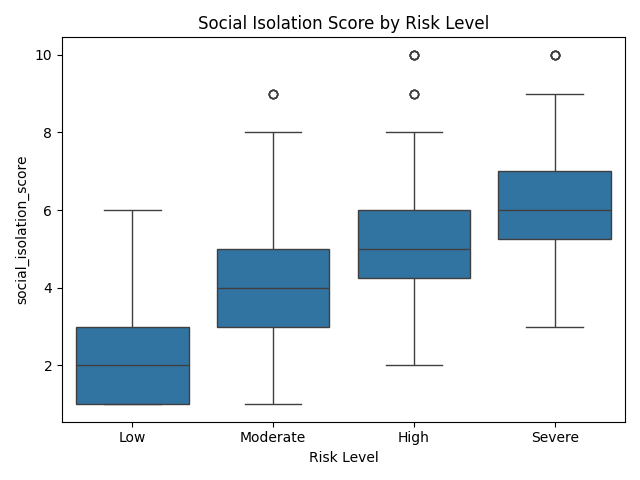
A boxplot showing a clear upward trend in isolation scores with increasing risk. Higher addiction risk is strongly associated with greater social isolation.

### 6. Average Monthly Spending by Risk Level (spending_by_risk.png)

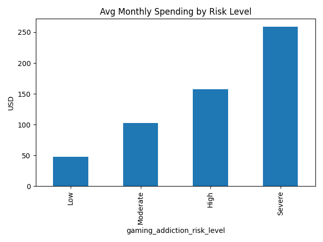
A bar chart showing a sharp increase in spending across risk levels. Severe-risk users spend significantly more, making spending a strong indicator of addiction risk.

### 7. Years Gaming by Risk Level (years_gaming_by_risk.png)

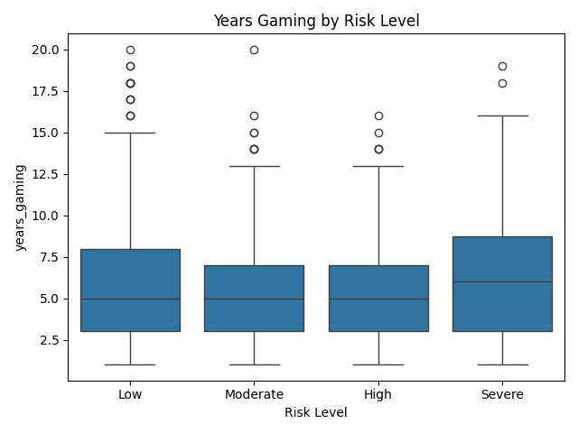
A boxplot showing similar distributions across all risk levels. This indicates that years of gaming experience is not a key factor in addiction risk.

### 8. Age Distribution by Risk Level (age_by_risk.png)

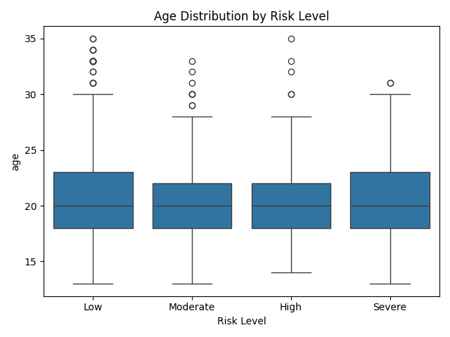
A boxplot showing similar age distributions across all groups. Age does not significantly differentiate addiction risk levels.

### 9. Daily Gaming Hours by Risk Level (daily_hours_by_risk.png)

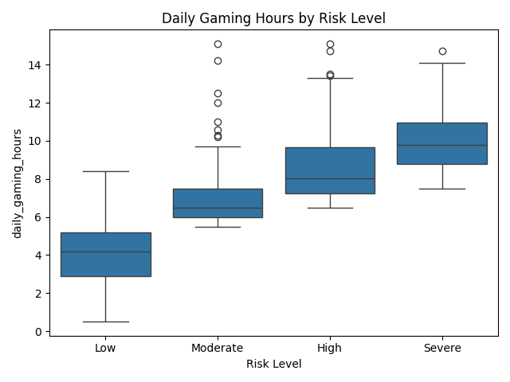
A boxplot showing a strong upward trend in gaming hours. Increased daily gaming time directly correlates with higher addiction risk.

### 10. Risk Level by Gender (risk_by_gender.png)

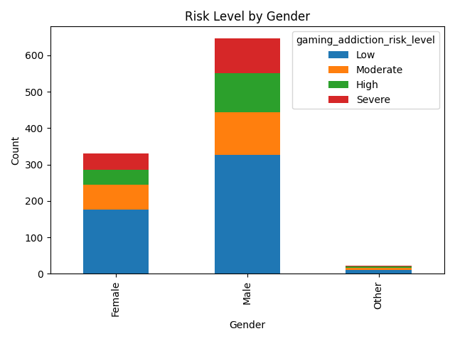
A stacked bar chart showing similar risk distribution across genders. Gender alone does not significantly influence addiction risk.

### 11. Gaming Addiction Risk Distribution (risk_distribution.png)

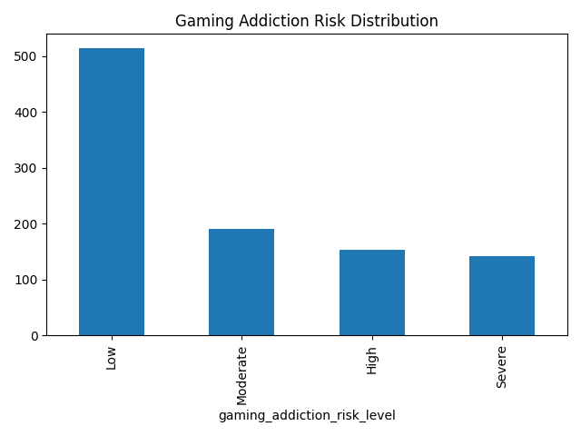
A bar chart showing overall distribution of users across risk levels. While most users are low risk, a significant portion falls into moderate-to-severe categories.

## Project Structure
business-performance-dashboard-new/
 ├── data/
 ├── notebooks/
 ├── sql/
 ├── images/
 └── README.md

## Conclusion

This analysis demonstrates that addiction risk is primarily driven by behavioral intensity—especially gaming hours, spending, and social isolation—rather than demographic factors. These insights can help design systems that promote healthier engagement and better user outcomes.

